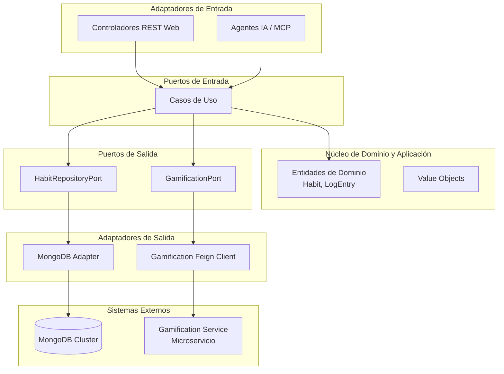

# HabitForge: Architecture Showcase

Proyecto de ingeniería de software orientado a demostrar la evolución arquitectónica de un sistema core para el registro y seguimiento de hábitos.

Este repositorio documenta el proceso de refactorización sistemática de un monolito basado en **MVC (Model-View-Controller)** hacia una **Arquitectura Hexagonal (Ports & Adapters)**, integrando principios de **Domain-Driven Design (DDD)**. Adicionalmente, expone la segregación de responsabilidades mediante un ecosistema de **Microservicios** integrados de forma asíncrona y síncrona.

## 🚀 Acerca del Proyecto

El sistema principal es una API de gestión de hábitos (Habit Journal) que permite a los usuarios definir metas y hacer seguimiento mediante logs periódicos. 

A nivel técnico, el objetivo central de este proyecto es servir como un *showcase* de patrones empresariales. Inició como una arquitectura en capas tradicional y evolucionó a una Arquitectura Hexagonal donde el Dominio se encuentra estrictamente aislado de las dependencias técnicas y frameworks. Además, la lógica de recompensas se extrajo a un microservicio independiente (`gamification-service`), demostrando integración entre sistemas distribuidos.

## 🏗️ Arquitectura del Sistema

La solución final (módulo `habit-journal-api-hex`) implementa el patrón **Ports & Adapters** (Arquitectura Hexagonal).

- **Núcleo de Aplicación y Dominio (Core):** Contiene las entidades de negocio fuertemente tipadas y los Casos de Uso. Este núcleo no tiene ninguna dependencia hacia Spring, bases de datos o servicios externos.
- **Adaptadores de Entrada (Driving Adapters):** Son los encargados de invocar los casos de uso. En este caso, controladores REST (`@RestController`) que exponen la API Web. A futuro, esta capa permite integrar fácilmente Agentes de IA / MCP.
- **Puertos de Entrada (Inbound Ports):** Interfaces que definen los casos de uso (ej. `CreateHabitUseCase`).
- **Puertos de Salida (Outbound Ports):** Interfaces definidas por el dominio para interactuar con el exterior (ej. `HabitRepositoryPort`, `GamificationPort`).
- **Adaptadores de Salida (Driven Adapters):** Implementaciones concretas de los puertos de salida, interactuando con MongoDB y otros microservicios (a través de Feign Clients).

### Diagrama Arquitectónico



## 🧩 Patrones de Diseño y Buenas Prácticas

A lo largo del código se han implementado múltiples patrones para garantizar extensibilidad y mantenibilidad:

- **Value Objects:** Encapsulan atributos específicos del dominio garantizando validez e inmutabilidad (DDD).
- **Strategy / State Pattern:** Preparado en el dominio para manejar diferentes estados o tipos de progreso del hábito.
- **Domain Events:** Emisión de eventos cuando un hábito es completado para notificar al sistema de gamificación.
- **Dependency Inversion Principle (DIP):** Los adaptadores dependen de las interfaces (puertos) del dominio, nunca al revés.
- **Data Transfer Objects (DTO):** Aislamiento de las representaciones externas frente a las entidades internas del dominio.

## 🧪 Gobernanza Arquitectónica y Testing

Para garantizar que los límites arquitectónicos no se rompan a medida que el proyecto crece, se integró **ArchUnit**. Estas pruebas automatizadas verifican que, por ejemplo, el paquete `domain` jamás importe clases de `infrastructure` o de frameworks como `org.springframework`.

Se emplean también exhaustivas pruebas unitarias (`@Test`) con JUnit 5 y Mockito para validar la lógica pura de negocio y las integraciones aisladas.

## 🛠️ Stack Tecnológico

| Tecnología | Versión | Propósito |
| :--- | :--- | :--- |
| **Java** | 21 LTS | Lenguaje principal (Records, Virtual Threads) |
| **Spring Boot** | 3.x | Framework de Inyección de Dependencias y Web |
| **Spring Data MongoDB** | 4.x | Persistencia del microservicio principal |
| **H2 Database / JPA** | - | Persistencia in-memory del microservicio de gamificación |
| **Spring Cloud OpenFeign** | - | Comunicación síncrona entre microservicios |
| **ArchUnit** | 1.x | Gobernanza de arquitectura y validación de capas |
| **JUnit 5 / Mockito** | - | Testing unitario y mocking |

## 🚀 Guía de Despliegue Local Paso a Paso

### Prerrequisitos
- **Java 21** instalado en la variable de entorno.
- **Maven** (o utilizar el wrapper `./mvnw` incluido).
- **Docker / Docker Desktop** (opcional, para levantar servicios externos localmente).
- **Base de Datos:** Se requiere un cluster MongoDB activo o una instancia local para la API de Hábitos. (Se proveen credenciales dummy por defecto en los perfiles `application.properties` que debes ajustar a tu entorno).

### 1. Levantar Servicios (Opcional vía Docker)
Si cuentas con un archivo `docker-compose.yml` para MongoDB:
```bash
docker-compose up -d
```

### 2. Ejecutar Microservicio de Gamificación
Este servicio levanta de forma autónoma con una BD H2 en memoria.
```bash
cd gamification-service
./mvnw spring-boot:run
```

### 3. Ejecutar Habit Journal API (Hexagonal)
En otra terminal, configura la variable de entorno para tu MongoDB o edita la URI en `application.properties`, y luego ejecuta:
```bash
cd habit-journal-api-hex
./mvnw spring-boot:run
```

Ambos servicios quedarán corriendo en diferentes puertos (ej. 8080 y 8082), y la API Principal se comunicará con el sistema de gamificación vía Feign Client.

## 🔌 Catálogo de Endpoints de la API

A continuación, un ejemplo representativo del endpoint principal para crear un hábito.

### Crear un Hábito (POST)
**Endpoint:** `POST /api/v1/habits`

**Comando cURL:**
```bash
curl -X POST "http://localhost:8080/api/v1/habits" \
     -H "Content-Type: application/json" \
     -d '{
           "name": "Meditar 10 minutos",
           "description": "Mindfulness matutino",
           "frequency": "DAILY"
         }'
```

**Respuesta Exitosa (201 Created):**
```json
{
  "id": "60d5ec49c1b4a629b8a2135a",
  "name": "Meditar 10 minutos",
  "status": "ACTIVE",
  "createdAt": "2024-05-12T08:30:00Z"
}
```

> [!NOTE]
> Al crearse exitosamente el hábito, el sistema (a través del `GamificationPort`) notifica de forma silenciosa al `gamification-service` para sumar puntos a la cuenta del usuario.
